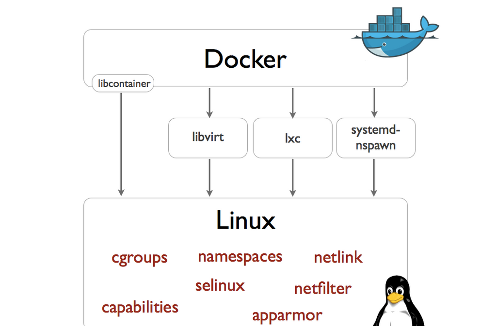
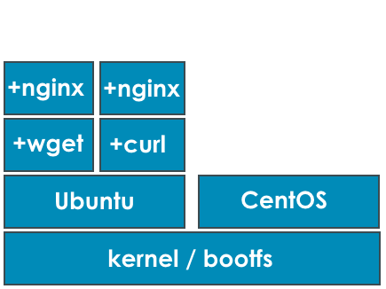
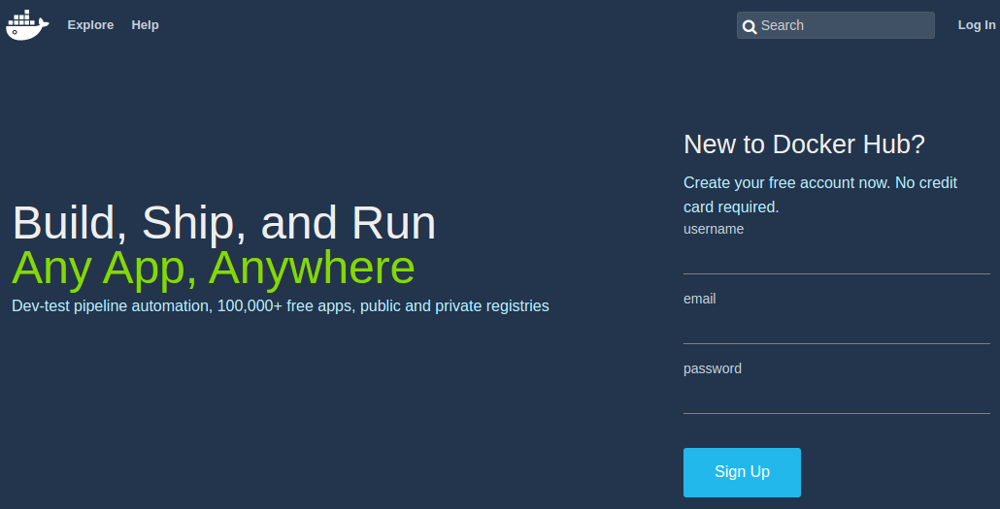
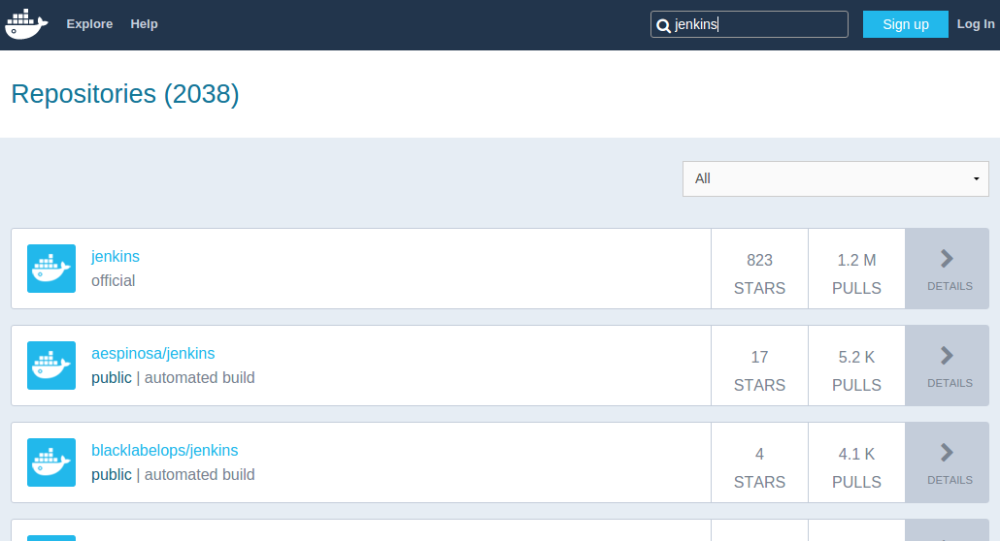
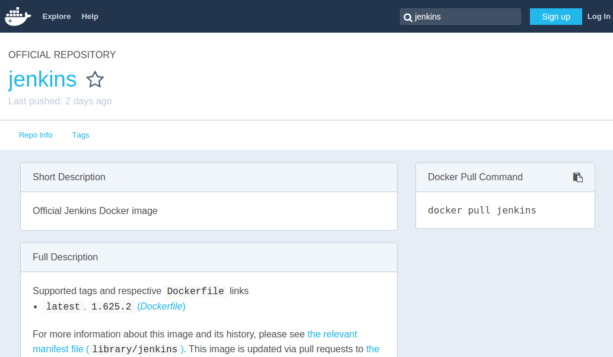

# Anatomie

<figure style="position: absolute; bottom: 300px; right: 300px;">
    
</figure>


## Architecture

- Développé en Go
- OSS / https://github.com/docker
- Architecture client / server
- API REST commune aux différentes briques

<figure style="position: absolute; bottom: 50px; right: 50px;">
    
</figure>


## Standing on the shoulders of giant




## VMs vs Containers

<br/>


<!-- .element: class="align-right" -->
/Repeat after me/ *Containers ARE NOT VMs !*


## Concepts

- **Image**: Ensemble des données / méta données nécessaires au fonctionnement (~ template / read-only)
- **Registry**: Dépôt d'image (public / private)
- **Container**: Instance d'une image
- **Volumes**: Accès au FS de l'hôte
- **Links / Networks**: Partage de la stack réseau entre containers


## Basics


<br/>
L'image contient le necessaire pour faire fonctionner le container

<br/>
La commande executée au lancement du container définit le cycle de vie du container

<br/>
```
$ id
uid=0(root) gid=0(root) groups=0(root)
```
<br/>
Complétement isolé


## Images

- Downloaded from remote
- Imported from tarball (ubuntu, centos, ...)
- Built with `docker commit`
- Built with  *Dockerfile*
- read-only 




## Dockerfile

```
FROM komljen/jdk-oracle
MAINTAINER Alen Komljen <alen.komljen@live.com>

RUN \
  wget -q -O - http://pkg.jenkins-ci.org/debian/jenkins-ci.org.key \
       | apt-key add - 
RUN echo "deb http://pkg.jenkins-ci.org/debian binary/" \
       > /etc/apt/sources.list.d/jenkins.list
RUN apt-get update
RUN apt-get -y install jenkins && rm -rf /var/lib/apt/lists/*

VOLUME ["/root/.jenkins"]

RUN rm /usr/sbin/policy-rc.d
CMD ["/usr/bin/java", "-jar", "/usr/share/jenkins/jenkins.war", "--webroot=/root/.jenkins/web"]

EXPOSE 8080
```


## My first container

<br/>
```
$ docker run docker/whalesay cowsay "big up @laposte"
 __________________ 
< big up @laposte >
 ------------------ 
    \
     \
      \     
                    ##        .            
              ## ## ##       ==            
           ## ## ## ##      ===            
       /""""""""""""""""___/ ===        
  ~~~ {~~ ~~~~ ~~~ ~~~~ ~~ ~ /  ===- ~~~   
       \______ o          __/            
        \    \        __/             
          \____\______/   

```


## En pratique

- Pull / "Aggregate file system"
- Add read-write layer
- Copy on write
- Bind ports
- Bind volumes
- Start command
- Name / sha256

<figure style="position: absolute; bottom: 100px; right: 150px;">
    
</figure>


## En pratique CLI

Options: 

 - ``-it``: interactive container
 - ``-d``: detach container from client and continue as a daemon
 - ``--name``: name of the container 
 - ``--rm``: remove container when terminated
 - ``-p``: publish port <host>:<container>
 - ``--volume``: deal with volumes
 - ``--link``: deal with links


## Quick start

- Récupérer une image: 

```
docker pull ubuntu:15.04
```

- Lancer une instance: 

```
docker run --rm -it ubuntu:15.04 bash
```

- Lister les instances: 

```
docker ps
```

- Supprimer une instance: 

```
docker rm <container-name-or-id>
```

- Démarrer / Arrêter une instance: 

```
docker stop  <container-name-or-id>
docker start <container-name-or-id>
```


# Hub




## Search




## Search




# Résumé 


# Demo time


